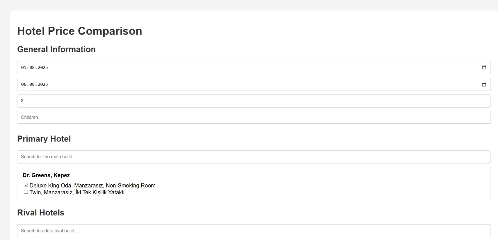
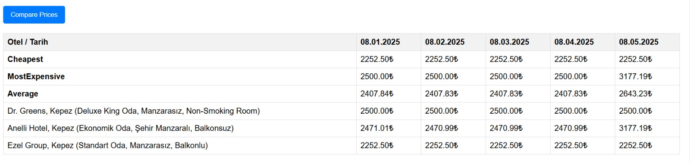

# 🏨 Etstur Hotel Price Comparator

Kullanıcıların belirli tarih aralıklarında seçtikleri bir otelin ve rakip otellerin fiyatlarını oda tipi bazlı karşılaştırmalı olarak görüntüleyebileceği bir web uygulamasıdır.

---

## 🚀 Özellikler

- 🔎 Ana otel ve birden fazla rakip otel seçme
- 🛏 Oda tipi bazlı fiyat karşılaştırması
- 📅 Tarih ve kişi sayısına göre dinamik filtreleme
- 📊 Fiyatların günlük karşılaştırmalı tablo halinde gösterimi
- 🧠 Ortalama, en ucuz ve en pahalı fiyatların otomatik hesaplanması
- 🖱 Basit ve kullanıcı dostu arayüz
- 📤 Şu an sadece [etstur.com](https://www.etstur.com) desteklenmektedir

---

## 🖼️ Ekran Görüntüleri

### Otel ve Oda Seçimi


### Otel ve Oda Seçimi


### Fiyat Karşılaştırma Tablosu


---

## 🧱 Kullanılan Teknolojiler

- **Frontend:** HTML, CSS, JavaScript
- **Backend:** Node.js, Express
- **Web Scraping:** Puppeteer, Cheerio

---

## 📦 Kurulum

```bash
git clone https://github.com/meliksavas/web-scraper.git
cd web-scraper
npm install
npm start